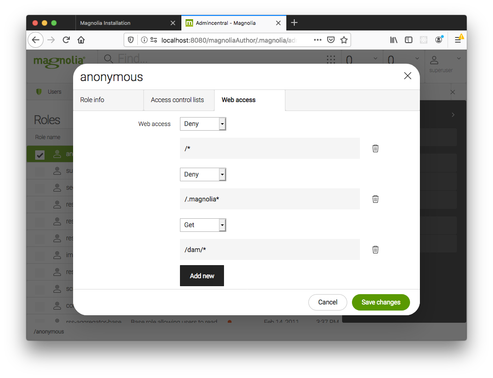

# magnolia_next

1) CD magnolia_next
2) mgnl jumpstart
3) mgnl start -p <path to tomcat folder>
4) Visit http://localhost:8080/
5) Login to system by useename:- superuser pwd :- superuser
6) Create New Page by Naming "home" and select "SPR HOME" template
7) Open another terminal
8) CD next_app
9) npm install
10) npm run dev
11) Upload img.zip file via magnolia admin tool
12) Enjoy...!!

### DAM

In order for images to be displayed:
Open the Security app, open the `Roles` tab, edit the `rest-anonymous` role, go to `Web access` tab, `Add new` with this path `/dam/*` set to GET.

In `Access control lists` tab modify `Dam` workspace by allowing `Read-only` access to `Selected and sub nodes` to `/`.
